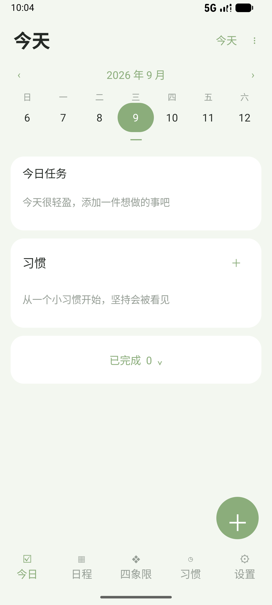

# Lumiday

让每一天，轻一点。参考提供的 UI 设计实现的离线原生 Android 日程与习惯应用，支持 Android 8.0 及以上。

## 安装

[下载 Lumiday 1.0.0 测试安装包](downloads/Lumiday-v1.0.0-debug.apk?raw=true)

这是可直接安装的 debug 签名体验版。后续覆盖安装必须保持应用 ID、签名证书一致并增加 versionCode；切换至正式签名前请导出备份。GitHub Actions 每次运行生成的 debug 签名可能不同，不建议用不同来源的测试包直接覆盖安装。正式发布需配置并长期保管自己的签名密钥，密钥不得提交到仓库。

## 功能

- 今日首页：选定日期任务、习惯及进度、可折叠的已完成任务。
- 周历 / 月历：日历区域上下滑动，或点击月份 / 横条，320 ms 平滑展开收起；左右箭头切换周 / 月。
- 待办日程：添加、编辑、删除、勾选完成，日期、全天 / 具体时间、描述与四档优先级。
- 日程时间列表、四象限页面。
- 习惯：名称、鼓励文字、每日目标、单位与图标；点击进入薄荷绿打卡页，逐次计数、撤销、完成状态、最近七天记录及连续统计。
- 饮水插画根据完成比例显示水位，水果插画在完成后变换状态；插画全部在本地绘制。
- 本地原子写入，JSON 备份导出 / 导入，旧版字段迁移、拒绝未来版本和无效数据，恢复前自动保存快照。

应用没有网络权限，没有账号、云同步或分析服务。首次启动为空数据，不会插入演示任务。

当前实现以用户明确提出的核心功能为范围。参考图中的节假日调休标记、语音输入、通知提醒、重复任务、分享成果未加入此版；插画为原生绘制，并非原图素材逐像素复制。

## 备份与升级

在「设置 → 导出完整备份」选择保存位置。更新、卸载或更换手机前建议先导出。导入会预览记录数量，再确认替换；替换前快照可在设置中导出。只存放在应用内部的快照会随卸载删除，因此不能替代外部导出。

数据结构及升级规范见 [备份说明](docs/BACKUP.md)。当前读取器兼容 schemaVersion 1 / 2；未来版本需要继续添加明确迁移函数，不能保证未知格式自动兼容。

## 开发与验证

Java 11、Android SDK 34、Gradle 7.6、Android Gradle Plugin 7.4.2。业务层无第三方运行依赖。

```sh
./gradlew assembleDebug assembleAndroidTest lintDebug
adb install -r app/build/outputs/apk/debug/app-debug.apk
adb install -r app/build/outputs/apk/androidTest/debug/app-debug-androidTest.apk
adb shell am instrument -w com.lumiday.app.test/com.lumiday.app.SmokeInstrumentation
```

构建产物在 `app/build/outputs/apk/debug/`。设备测试在独立目录中验证数据往返、部分打卡保存、旧版迁移、非法备份保护、恢复快照、五个页面、日历动画及习惯统计；以输出 `PASS` 为通过依据。截图为实际模拟器画面。


