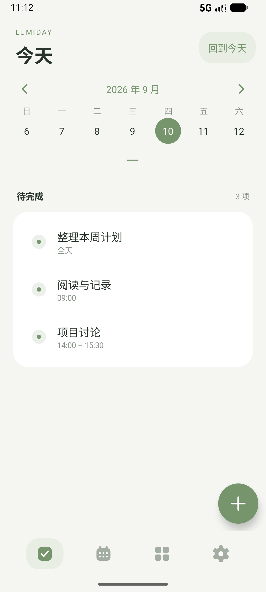
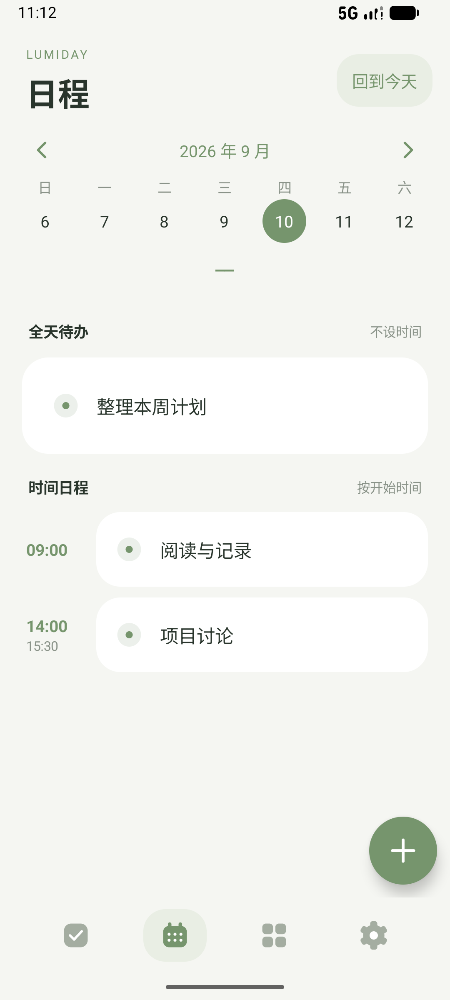
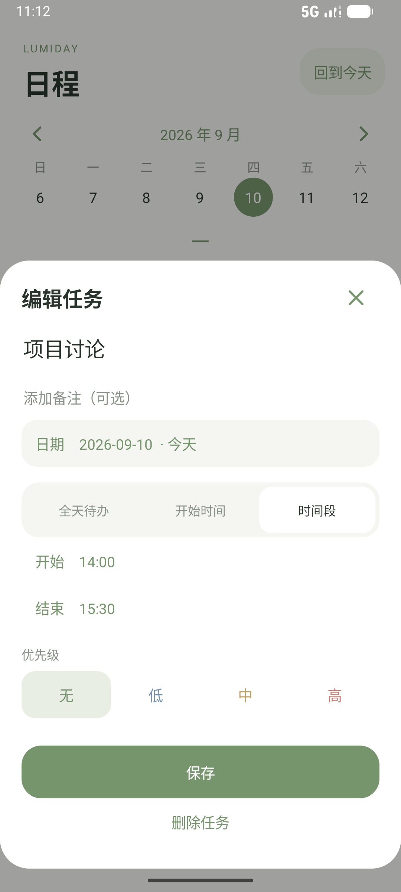

# Lumiday 2

一个专注于待办与日程的离线 Android 应用。需要 **Android 16 或更高版本**。

[下载 Lumiday 2.0.0 测试安装包](downloads/Lumiday-v2.0.0-debug.apk?raw=true)

## 这一版的变化

- 统一 26 dp 图标网格的纯图标底部导航，保留无障碍文字描述。
- 柔和的鼠尾草绿、暖白色卡片和留白，去掉默认输入下划线和大量边框。
- 移除习惯模块。旧习惯数据仅作为历史数据保留在导出备份中。
- 添加按钮是应用内部独立的悬浮图层，“＋”按画布中心绘制；直接拖动可调整位置，切换页面及重新打开仍保留。位置限制在内容区域内，不遮挡系统栏或底部导航。
- 点击添加直接进入任务编辑面板：默认全天待办，也可只设置开始时间，或设置同一天的开始 / 结束时间。
- 日程中全天待办独立显示，有时间的日程按开始时间升序排列，避免重复显示时间。
- 周历与月历顺滑展开 / 收起，选中周在过渡时保持连续移动。
- 编辑面板取消不写入，旋转屏幕保留编辑草稿，保存后切换至任务所在日期。

悬浮按钮只出现在 Lumiday 内部，不申请“显示在其他应用上层”权限。设置中可重置按钮位置。

## 安装与升级

仓库 APK 使用本机持续保留的 debug 证书签名，和此前仓库中的 v1 APK 同源。若设备原先安装的就是该 v1 包，可在 Android 16+ 上覆盖更新；更新前仍建议导出备份。旧系统不能安装 v2。

这是测试签名版本。GitHub Actions 的 debug 包可能使用不同证书，不能保证覆盖安装本机生成的 APK。正式发布需配置长期保管的 release 签名密钥；密钥不得提交到仓库。

全部数据储存在应用内部，应用没有网络权限、账号或云同步。备份支持 v1、v2、v3；未知未来格式会被拒绝，导入前会确认并保存恢复前快照。详见 [备份说明](docs/BACKUP.md)。

## 构建

Java 17、Android SDK 36、AGP 8.9.1、Gradle 8.11.1。业务无第三方运行依赖。

```sh
./gradlew assembleDebug assembleAndroidTest lintDebug
adb install -r app/build/outputs/apk/debug/app-debug.apk
adb install -r app/build/outputs/apk/androidTest/debug/app-debug-androidTest.apk
adb shell am instrument -w com.lumiday.app.test/com.lumiday.app.SmokeInstrumentation
```

设备测试在独立数据目录验证旧备份迁移、时间段、添加面板、排序、导航、日历动画和悬浮拖动。验证范围见 [测试记录](docs/TESTING.md)。

## 界面

  
