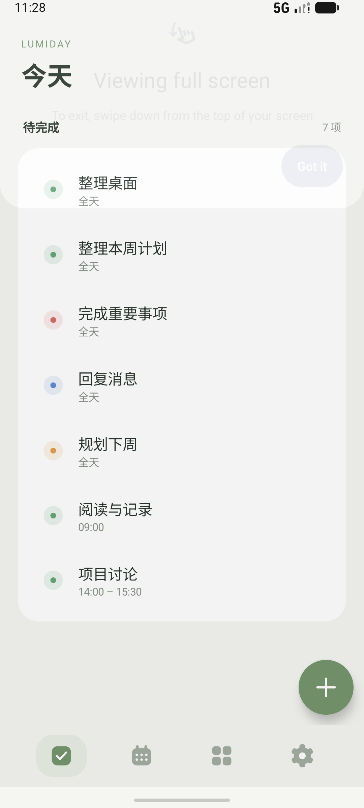
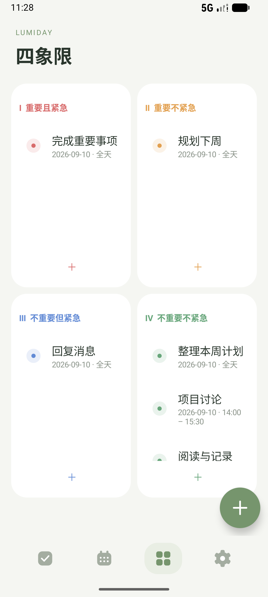
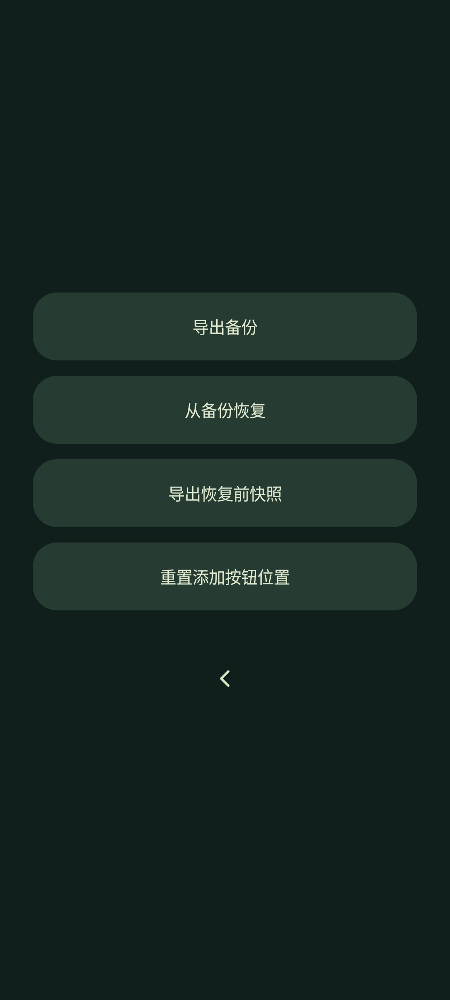
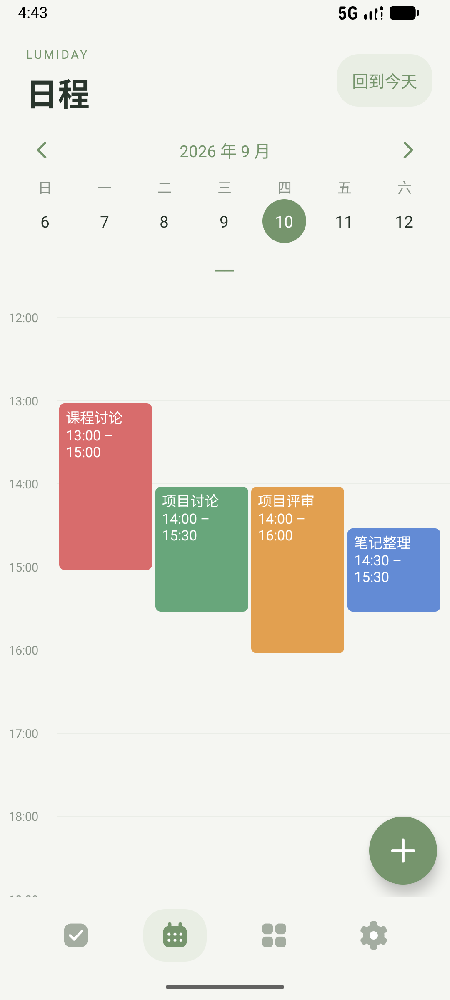
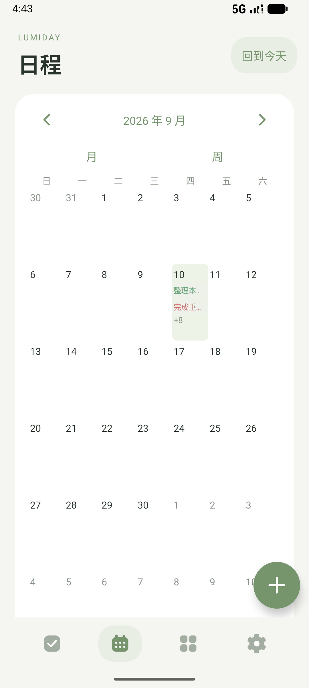

# Lumiday 2.3

一个专注于待办与日程的离线 Android 应用。需要 **Android 16 或更高版本**。

[下载 Lumiday 2.3.0 测试安装包](downloads/Lumiday-v2.3.0-debug.apk?raw=true)

## 这一版的变化

- 2.3：点击“日程”从标题位置展开日历浮层，底层日程使用 RenderEffect 高斯模糊；上下滑动切换月 / 周，并以动画展开收缩。
- 任务详情统一使用圆角底部面板及绿色主按钮。
- 设置页按提供的参考图使用原艺术字与“时间 / 只属 / 于你”断句，保留慢速落叶和滑动显示设置按钮。


- 点击左上角“日程”进入任务月历，可切换周视图；每天显示任务色条，超出部分显示 +N。
- 非全天日程使用 0–24 时的时间轴，按持续时间绘制色块，重叠任务等宽分轨。点击查看详情及编辑 / 删除，长按完成。
- 时间日程必须同时设置开始和结束时间，结束可选 24:00。旧版仅开始时间任务转为全天，原时间保留在详情和备份中。
- 设置画面使用浅绿背景、渐变衬线大字和缓慢飘落的树叶，保留滑动显现备份按钮。

- 今天页不显示日历，始终展示今天的任务；在日程页查看其他日期不会改变今天页内容。
- 仅日程页保留周 / 月日历、全天待办与按开始时间排序的日程。
- 四象限恢复 2 × 2 布局，汇总各日期任务。红 / 橙 / 蓝 / 绿分别对应高 / 中 / 低 / 无优先级，点击象限标题、空白处或加号直接预选对应优先级添加。
- 设置页为全屏动态文字，使用“时间 / 只属 / 于你”的参考图断句。初始无标题、导航、按钮及额外说明文字。
- 下滑时文字淡出，导出备份、恢复备份、恢复前快照、重置按钮位置逐渐显现；反向滑动可回到文字。也支持常见的向上滑动浏览操作。
- 文字有缓慢漂浮和流动色彩，离开页面会停止动画。可用系统返回手势离开；功能按钮状态下也有返回图标。

首次使用沉浸全屏时，Android 可能显示一次系统自带的退出全屏提示，不属于应用页面内容。

保持 v2 的纯图标导航、可拖动悬浮添加、全天 / 同日起止时间、离线存储和 v1–v4 备份兼容。悬浮按钮不申请跨应用覆盖权限。

## 安装与升级

仓库 APK 使用本机持续保留的 debug 证书签名，和此前仓库中的 v1 APK 同源。若设备原先安装的就是该 v1 包，可在 Android 16+ 上覆盖更新；更新前仍建议导出备份。旧系统不能安装 v2。

这是测试签名版本。GitHub Actions 的 debug 包可能使用不同证书，不能保证覆盖安装本机生成的 APK。正式发布需配置长期保管的 release 签名密钥；密钥不得提交到仓库。

全部数据储存在应用内部，应用没有网络权限、账号或云同步。备份支持 v1、v2、v3、v4；未知未来格式会被拒绝，导入前会确认并保存恢复前快照。详见 [备份说明](docs/BACKUP.md)。

## 构建

Java 17、Android SDK 36、AGP 8.9.1、Gradle 8.11.1。业务无第三方运行依赖。

```sh
./gradlew assembleDebug assembleAndroidTest lintDebug
adb install -r app/build/outputs/apk/debug/app-debug.apk
adb install -r app/build/outputs/apk/androidTest/debug/app-debug-androidTest.apk
adb shell am instrument -w com.lumiday.app.test/com.lumiday.app.SmokeInstrumentation
```

设备测试在独立数据目录验证旧备份迁移、时间段、添加面板、排序、导航、日历动画和悬浮拖动。验证范围见 [测试记录](docs/TESTING.md)。

## 界面

 

 

  
