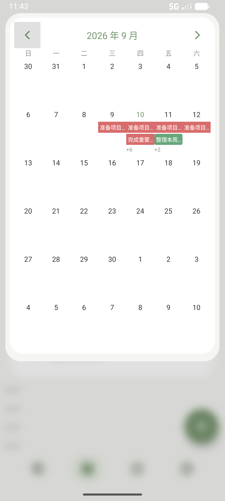
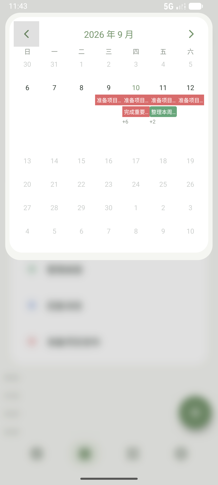
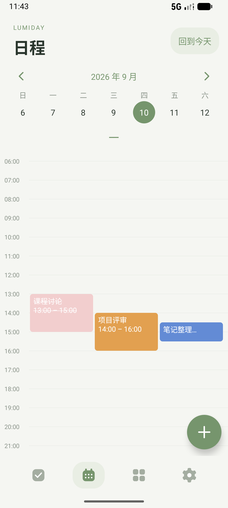

# Lumiday 2.4

离线 Android 日程与待办应用，需要 **Android 16+**。

[下载 Lumiday 2.4.0 测试安装包](downloads/Lumiday-v2.4.0-debug.apk?raw=true)

## 本版功能

- 点击“日程”打开模糊背景的日历浮层。上滑时其他周渐隐收缩，当前周移到顶部；下滑展开月历。取消月 / 周切换按钮。
- 日历任务统一白字、红橙蓝绿优先级背景。长按切换完成状态，完成后背景变淡、文字加删除线；时间轴采用同样规则。
- 未完成跨日任务优先显示并连接各天色块，日期数字不着色。常规与已完成内容位于后面，超量显示 +N。
- 时间轴初始至少三轨，重叠较多时增加轨道。双指缩放围绕触点调整间距，范围为一屏约 15 小时至 2 小时；最小比例可完整看到 06:00–21:00。过长文字用省略号显示。
- 时间日程支持开始 / 结束日期及时间，跨午夜按每日实际覆盖时段显示。新建或修改开始时间时不能早于本机当前分钟；未改开始时间的历史任务仍可编辑备注。
- 全天待办可设置开始日和结束日，或清除日期。无日期的未完成待办顺延到今天，完成后保留在完成当天，不复制任务。
- 今天页只显示今天，四象限可按优先级添加，纯图标导航与可拖动添加按钮保留。
- 设置页使用用户提供的艺术字参考图，按“时间 / 只属 / 于你”断句，慢速落叶动效；滑动显示备份与重置按钮。

## 本地数据与升级

所有数据保存在应用内部，无网络权限、账号或云同步。备份格式 v5，兼容 v1–v4；旧版仅开始时间记录迁移为全天，原时间保留。新字段包括结束日期、无日期待办标记和完成日期，详见 [备份说明](docs/BACKUP.md)。

仓库中的 APK 使用持续保留的本机 debug 证书，可覆盖安装此前同源版本。更新前建议导出备份。GitHub Actions 构建的 debug 包可能使用不同证书。正式发布需要独立长期保管的 release 签名。

## 构建与验证

Java 17、Android SDK 36、AGP 8.9.1、Gradle 8.11.1。

```sh
./gradlew assembleDebug assembleAndroidTest lintDebug
adb install -r app/build/outputs/apk/debug/app-debug.apk
adb install -r app/build/outputs/apk/androidTest/debug/app-debug-androidTest.apk
adb shell am instrument -w com.lumiday.app.test/com.lumiday.app.SmokeInstrumentation
```

Android 16.1 模拟器通过回归与边界测试。测试使用独立数据目录。尚未完成实体手机多厂商性能验证，见 [测试记录](docs/TESTING.md)。

  
